## Oh snap, snapshots! Unit & integration testing with Jest & Enzyme

_A screenshot journey_

## React Devtools - Inspiration

Using Webpack's "watch mode" is a great way to develop web apps. As you edit code, the app rebuilds and automatically reloads the page.

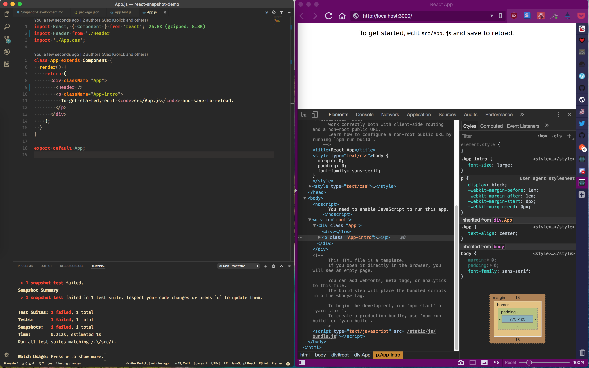

Did you know Jest also has a watch mode?

## Snapshot-Driven Development

```
jest --watch
```

Watch mode lets you develop iteratively using snapshots of your components in different states as a way to confidently refactor and add features. In watch mode, Jest automatically re-runs your tests when files change. You can inspect changes and update snapshots with one keypress by pressing "u". Cool!

Let's walk through a scenario: Adding tests to a simple app boostrapped with `create-react-app`.

_The App component_
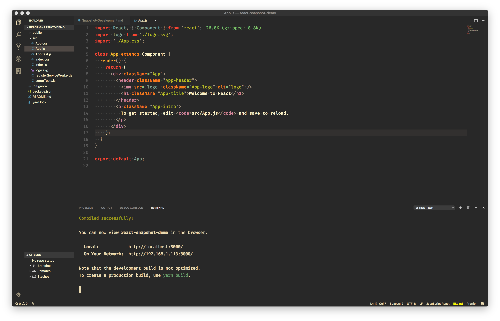

_The first test_
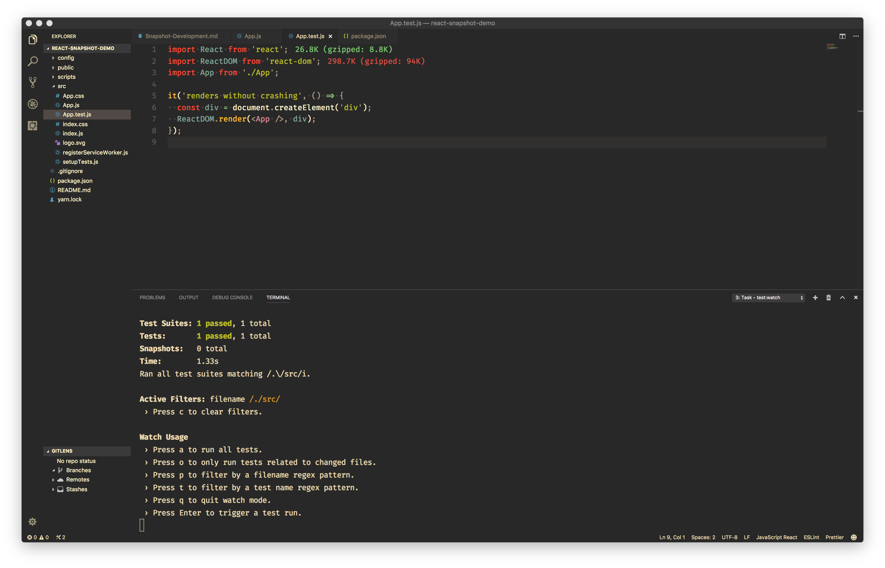

_Adding a snapshot_
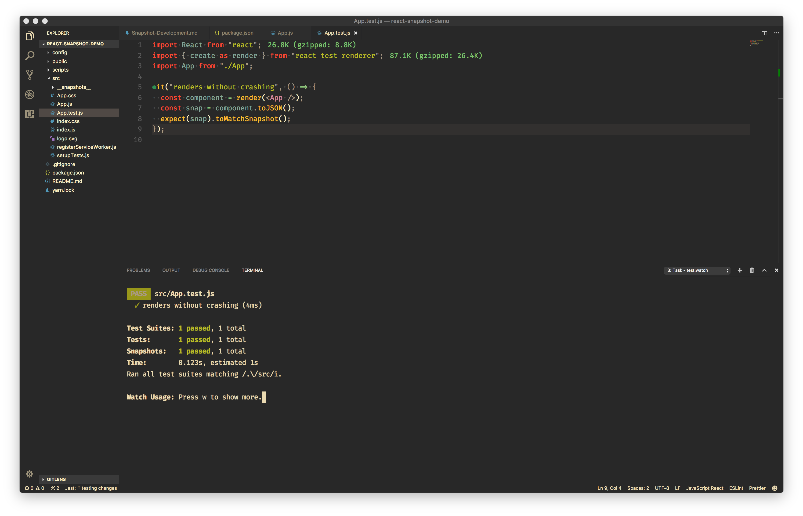

_Inspecting the snapshot file_
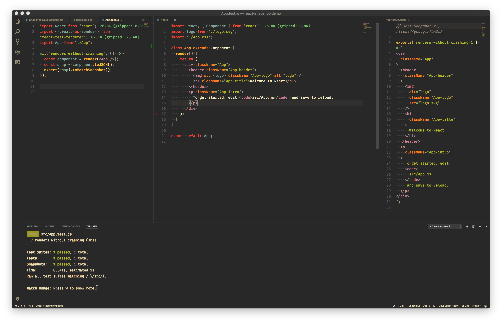

_Refactoring the header into its own component: snapshot fails!_
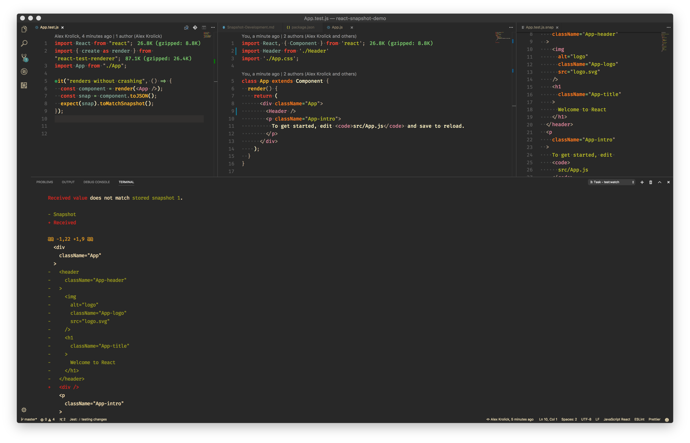

__Refactoring the header into its own component: updated snapshot_
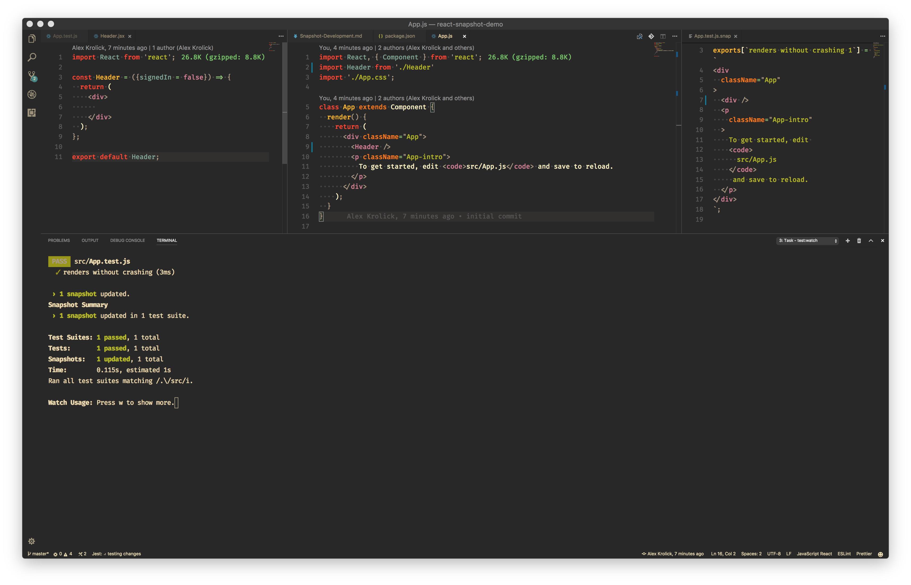

_Adding props and condtional logic to the new Header component: snapshot fails_
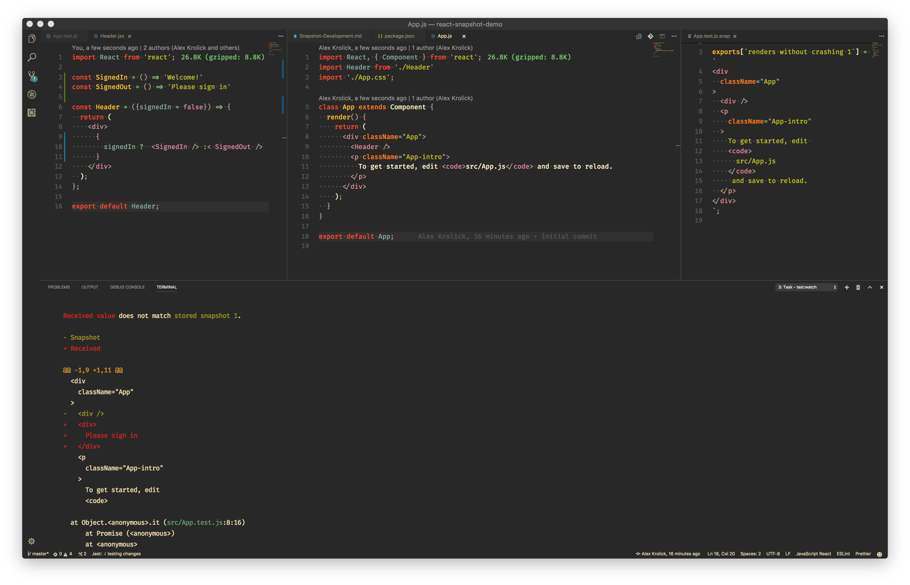

_Adding props and condtional logic to the new Header component: updated snapshot_
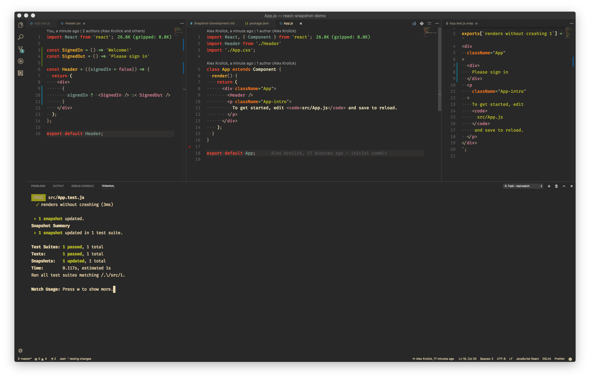

## Shallow rendering

To avoid coupling the Header implementation to the App component, you can use Enzyme's shallow render and Enzyme-To-JSON to snapshot only the top level render tree.

_Switching to a shallow snapshot: snapshot fails_
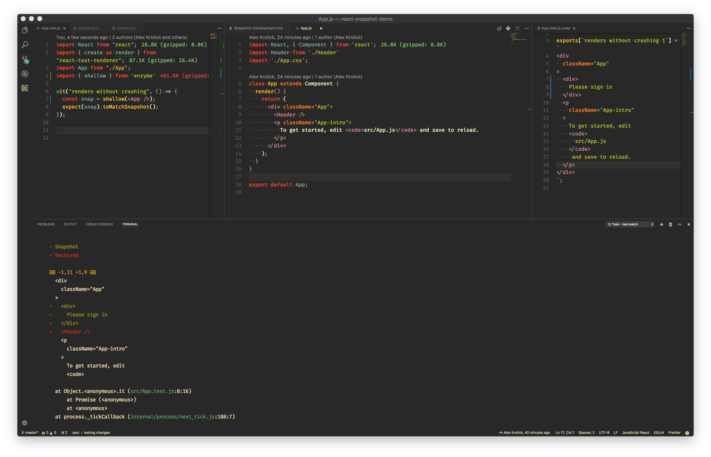

_Switching to a shallow snapshot: updated snapshot_
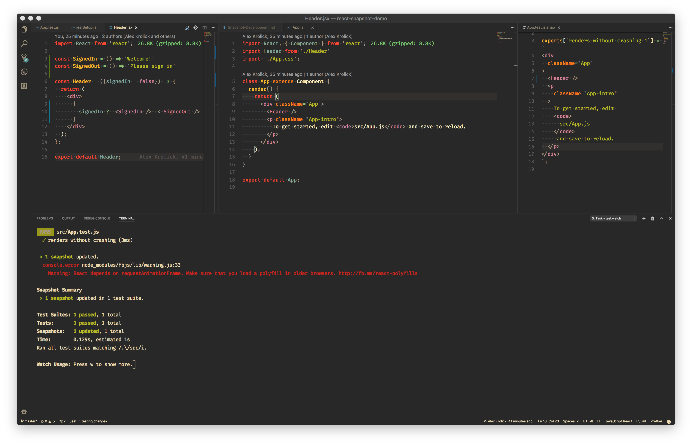

## Moving beyond snapshots - .find() and Markers

As you add more snapshot tests you may discover that some become brittle, need to be updated to often, or that you want to assert about more specific results than what high-level snapshotting provides.

To do this you can use "test markers" (special classes or data tags that are only meaningful to tests). For example, the Header component can be rendered into different states but it might be nice to assert that something specific appears when logged in and something else when logged out. Add a test marker and use Enzyme DOM traversal methods like `.find` to assert that they appear when expected.

_Shallow rendering the Header in different states_
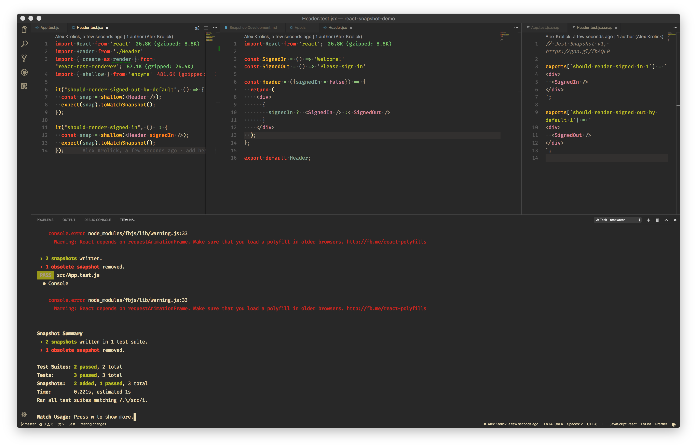

_Adding test marker tags (`data-test="xyz"`) and .find()_
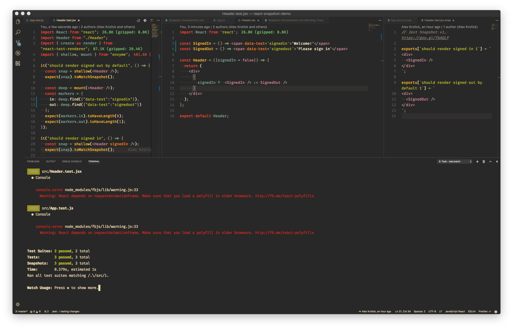

_Zoomed in on the marker implementation_
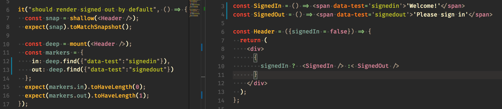

At this stage we might consider removing the snapshots altogether since we've identified and `expect`ed what we care about.

## Testing Stateful Components

Next up:
- Testing stateful components using Enzyme  ([`component.setState`](http://airbnb.io/enzyme/docs/api/ShallowWrapper/setState.html))
- Mocking dependencies as an alternative to shallow rendering ([`jest.mockFn()`](https://facebook.github.io/jest/docs/en/mock-functions.html#content))
- Test harnesses for React Context and other globals

## Discussions around the web - when to use snapshots

- https://tinyletter.com/kentcdodds/letters/effective-snapshot-testing
- https://www.briefs.fm/3-minutes-with-kent/49
- https://www.bignerdranch.com/blog/integrated-testing-with-react-native-part-2-minimize-coupling/
- https://twitter.com/thejameskyle/status/920014248654151680
- https://twitter.com/searls/status/919594505938112512

## Adding Jest & Enzyme

```
yarn add --dev react-test-renderer jest enzyme enzyme-adapter-react-16 jest-enzyme enzyme-to-json
```

Follow the [Enzyme setup][enzyme-setup] instructions for your environment.

[enzyme-setup]: https://github.com/blainekasten/enzyme-matchers/tree/master/packages/jest-enzyme#setup
